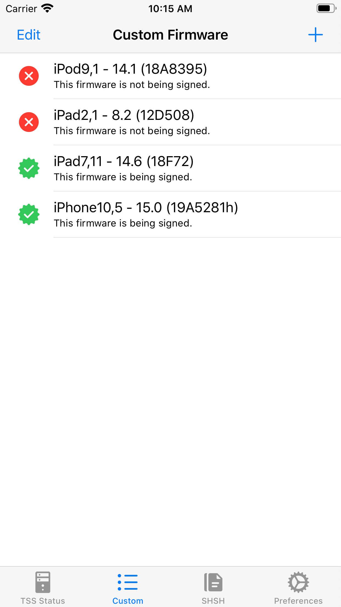

# MobileTSS
  

An iOS app to check signing status of firmwares from Apple server and save blobs to local.

## Features
* Check signing status for every firmware including betas and OTAs
* Save blobs for signed firmwares
* Check signing status in background
* Show extracted info in SHSH2 file (not available for 32-bit shsh)
* ~~Verify shsh2 files~~ (temporarily disabled in v2.0)
* Allow to specify custom apnonce and generator (required for A12+ devices)
* No Jailbreak required
* Download latest SHSH blobs in background (v2.0)
    * Push notifications on success or error
* Create profiles for different devices (v2.0)
    * Easy switch between device profiles 

## Requirements
Minimum: iOS 12.2.  

If you need to run it on lower iOS version, please install v1.2 (iOS 8.0+) instead.  
Since MobileTSS can create device profiles in v2.0, you do not need to run it on devices you want to save blobs for; you can simply create a device profile and fill ECID then all set.

## Tutorial
This project is written in Swift 5 so you need to have Xcode 12 or above installed on Mac to compile it. After finish downloading the project zip, open project file and start to compile and should run on simulator. 

## Support
Any contributions are welcome. This project is under LGPL-3.0 license.  

## Credits
* @tihmstar for [tsschecker](https://github.com/tihmstar/tsschecker) and [img4tool](https://github.com/tihmstar/img4tool)
* @xerub and @planetbeing for [xpwn](https://github.com/xerub/xpwn)
* Firmware data information provided by [ipsw.me](https://ipsw.me)

## Preview
 
 

